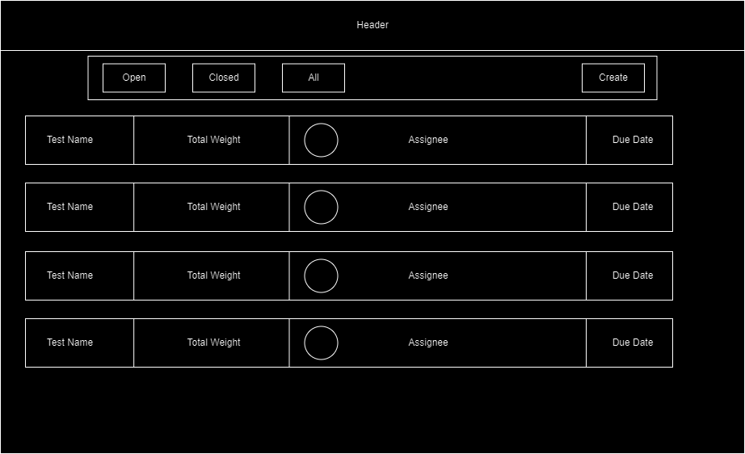
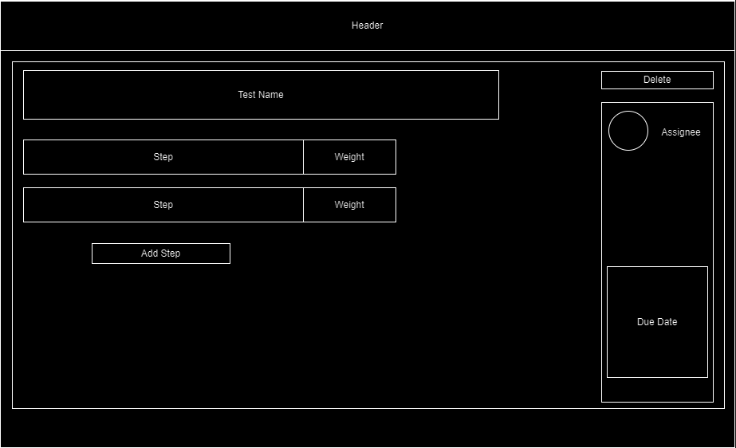
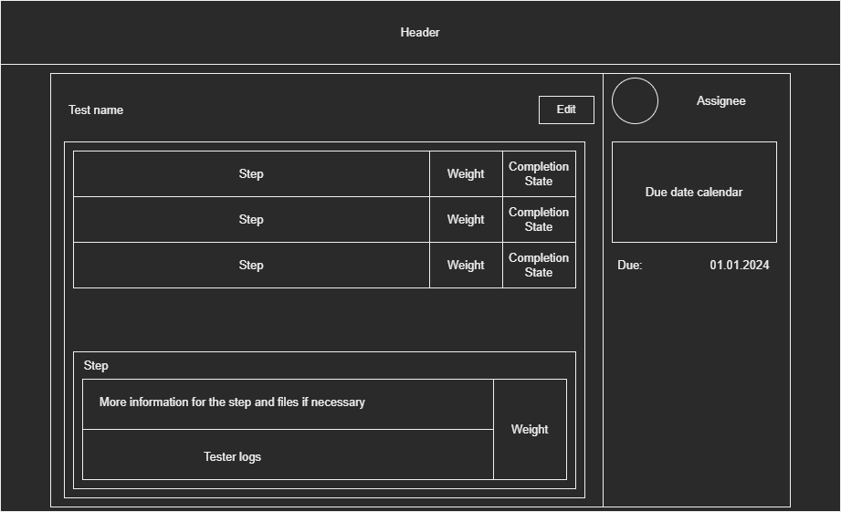
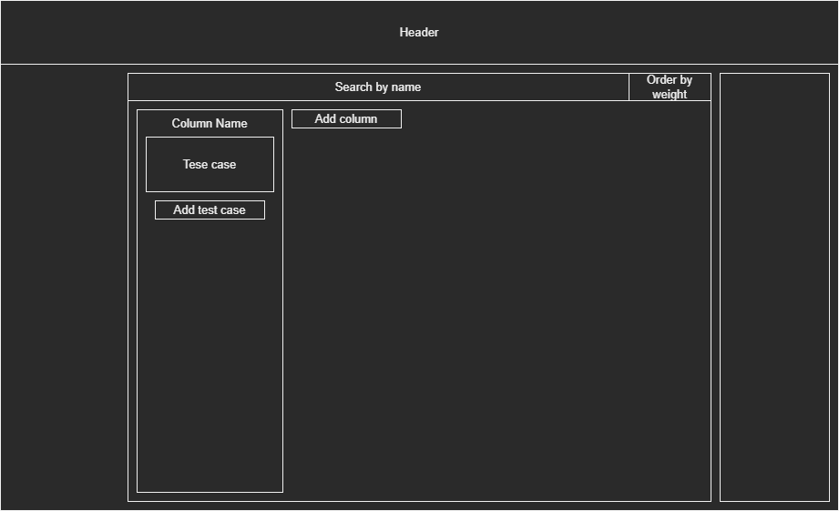
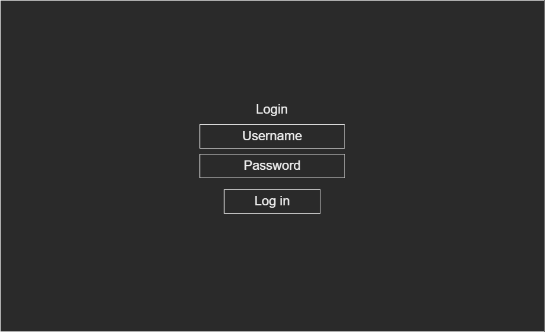
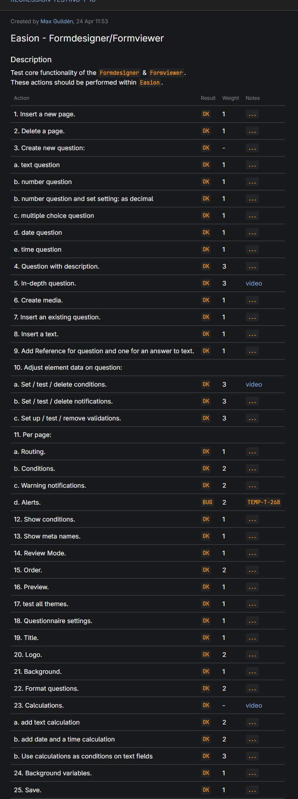
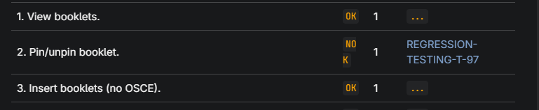

# Client Communication Log

# Table of Contents

- [Introduction](#introduction)
- [Sprint 0](#Sprint 0)
- [Sprint 1](#Sprint 1)
- [Sprint 2](#Sprint 2)
- [Sprint 3](#Sprint 3)

## Introduction

In this document, all the communication between us and the
client will be displayed. There have been no emails sent 
between us, thus you will not see any information about 
emails. All communication has been conducted on discord.

Any text on a new line, that does not contain date and sender information
,is written in *italics* or is not related to meeting talk, is sent
by the last person mentioned. Any text in *italics* are explanations or 
thoughts, and are not real messages.

## Sprint 0
First communication was on the 29th November when we went to the company.
They showed us a presentation, and then we asked some questions. We do not have exact questions from the meeting, but still some of the questions we asked where:

Is there a need for different roles, like admin privileges and normal ones.
Answer to that was yes.

We had a talk about our choice of technologies. Using Svelte, TypeScript and MySQL.
They said it was ok, no issues.

We asked about how to send a notification about the blocker.
They said any way that is outside our program.

We talked about what permissions should different roles have.

In the discord we asked one question to clarify if we understood the role permissions

*30/11/23* **Justin**: hello we are currently defining the functional design and we where wondering if we have the correct permissions assigned to the correct role:

Tester: change completion state, move between columns, edit description
Developer: edit tests, add tests, remove tests
Admins: reset board, delete tests, add tests, edit tests''

## Sprint 1

*We received information about our question from Sprint 0*

*1/12/23* **Nick**: looks good. but why does a tester need to change te test description

*1/12/23* **Viktor**: Yes we wrote that a bit wrong, we meant the logs where they can input information for the test they ran

*1/12/23* **Nick**: Ok

*A few days later, we sent our wireframes to get feedback.*

*5/12/23* **Viktor**: Hello, these are the wireframes we created. Wanted to shared them with you for possible feedback.
this is for the place where you can see a list of all test cases, outside of a board.

-----------------------------------------------
This one is for creating a new test case

----------------------------------------------
This is the page which opens when you click on a test case and you can see more information about it

-----------------------------------------
This is the main screen with the board, where you can put columns and issues.

------------------------------
and a simple log in page

*6/12/23* **Nick**: i'll take a look at them today
is this a overview of a sprint ?

what do the buttons do?

i suggest making this in a flow
all test fall into a module in the application i might be a nice idear to be able to see and groups test based on these modules.

And the due date are the same for all tests in a sprint

*6/12/23* **Viktor**: Okay, we will change them a bit, we also got some new ideas today.

*We decided it's time for the first meeting to discuss the ideas we have
and progress*

*7/12/23* **Alex**: Good afternoon, @Nick can we schedule a meeting on next Tuesday morning, does it work for you?

*8/12/23* **Nick**: I'll get back to you on that

*12/12/23* **Nick**: can we have a meeting online, let say friday ?
or ask me some questions here

*12/12/23* **Viktor**: Is Friday at 9:30 okay?
We would prefer a meeting to get feedback

*It was the day before the meeting was supposed to be, and we still
had no answer, so I sent a message with notification to attempt to get
his attention*

*14/12/23* **Viktor**: @Nick ?

*15/12/23* **Randy**: @Nick was ill the last few days wil contact him if he is available today

*15/12/23* **Nick**: I'm back. 
is 10:00 ok

*15/12/23* **Viktor**: Yes
Online here in discord?

*15/12/23* **Nick**: Yes

*Meeting 1 on Friday, 15th of December*

During the meeting we showed them what we have so far. Nick noted that 
they do not want per day test counter, which we thought of doing. He also
provided us an example test case to use.

*15/12/23* **Nick**:
we have Description, Accounts, Steps, an Notes in a test case.

and some of these steps have video
here is the markdown exampe

| Action                                                       | Result | Weight | Notes                       |
|--------------------------------------------------------------|--------|--------|-----------------------------|
| 1. Insert a new page.                                        | `OK`   | 1      | `...`                       |
| 2. Delete a page.                                            | `OK`   | 1      | `...`                       |
| 3. Create new question:                                      | `OK`   | -      | `...`                       | 
| a. text question                                             | `OK`   | 1      | `...`                       |
| b. number question                                           | `OK`   | 1      | `...`                       |
| b. number question and set setting: as decimal               | `OK`   | 1      | `...`                       |
| c. multiple choice question                                  | `OK`   | 1      | `...`                       |
| d. date question                                             | `OK`   | 1      | `...`                       |
| e. time question                                             | `OK`   | 1      | `...`                       |
| 4. Question with description.                                | `OK`   | 3      | `...`                       |
| 5. In-depth question.                                        | `OK`   | 3      | [video](https://GOOGLE.COM) |
| 6. Create media.                                             | `OK`   | 1      | `...`                       |
| 7. Insert an existing question.                              | `OK`   | 1      | `...`                       |
| 8. Insert a text.                                            | `OK`   | 1      | `...`                       |
| 9. Add Reference for question and one for an answer to text. | `OK`   | 1      | `...`                       |
| 10. Adjust element data on question:                         |        |        |
| a. Set / test / delete conditions.                           | `OK`   | 3      | [video](https://GOOGLE.COM) |
| b. Set / test / delete notifications.                        | `OK`   | 3      | `...`                       |
| c. Set up / test / remove validations.                       | `OK`   | 3      | `...`                       |
| 11. Per page:                                                |        |        |
| a. Routing.                                                  | `OK`   | 1      | `...`                       |
| b. Conditions.                                               | `OK`   | 2      | `...`                       |
| c. Warning notifications.                                    | `OK`   | 2      | `...`                       |
| d. Alerts.                                                   | `BUG`  | 2      | `TEMP-T-268`                |
| 12. Show conditions.                                         | `OK`   | 1      | `...`                       |
| 13. Show meta names.                                         | `OK`   | 1      | `...`                       |

notes can also contain links to tickets created for the a bug thats found;
for example:

## Sprint 2

*20/12/23* **Nick**: How is it going guys?

*20/12/23* **Viktor**: We have done a bunch of work for the back end, its mostly done now. So we will be focusing on front end and connecting them now.
we have a question actually, since we are goning to send emails for notifications, we need to save the emails. But do you want log in to be with that same email? Or should we also include a username, to be used for log in?

*22/12/23* **Randy**: Since Nick is not working today here is an answer: if there are no mayjor co ncerns I would prefer to have the email adres as username also.

*At time, we decided that it is time to set up another meeting to get feedback on your progress.*

*09/01/24* **Jafar**: @Nick Happy new year,
Would it be possible to arrange a meeting either this week or next week?
Would Tuesday or Thursday be convenient for you?

*09/01/24* **Nick**: doe you want this in person or online in teams

*09/01/24* **Alex**: In person is preferred

*09/01/24* **Nick**: Tuesday is ok someware.  between 11 and 16:00

*11/01/24* **Viktor**: We agreed on Tuesday 11:15 in person

## Sprint 3

*16/01/24* **Jafar**: @Nick Just a reminder, Today at 11:15, we have a 
meeting. Right?

*16/01/24* **Nick**: yes

*Meeting 2 on Tuesday, 16th of January* 

During this meeting we got a lot of feedback on what we have, but mostly 
on what we don't have. He pointed out some issues with the current way 
the system worked, mainly with how the test cases data is stored. 
Unknowingly to us, we somehow made a very big mistake in how we store the
data for the tests, since we wanted multiple sprints to be able to contain the same test, the information about assignee and status must be 
sprint related, and not global for this test. He also gave us feedback on
the front end we already had. 

With the knowledge acquired, and realization on how much there is to do
we agreed to set up daily meetings for until the end of the project, so 
that we can deliver a product we are proud of, or at least we are not 
ashamed of showing.

*After this meeting we had only one question before the last meeting*

*22/01/24* **Viktor**: @Nick who should have access to the modules page?
Admin -> see, create, delete and edit
Should developer be able to do same as admin?
And tester I assume should be able to see, but not create, delete, edit.
Or should everyone be able to do all the actions?

*22/01/24* **Nick**: admin should be a developer but with user management and control of when a sprint starts and ends

*This was the last time we communicated on discord or any other way 
before the final product showcase meeting on Thursday, 25th of January.*