# SCRUM DOCUMENTATION

## Table of Contents

- [Introduction](#introduction)
- [Start up](#start-up)
- [Backlog](#backlog)
- [Introduction](#introduction)
- [Start up](#start-up)
- [Backlog](#backlog)
- [Sprint 0](#sprint 0)
  - [End of sprint 0](#end of sprint 0)
  - [Retrospectives](#retrospectives)
- [Sprint 1](#sprint 1)
  - [End of sprint 1](#end of sprint 1)
  - [Burn down chart](#burn down chart)
  - [Retrospectives](#retrospectives)
- [Sprint 2](#sprint 2)
  - [End of sprint 2](#end of sprint 2)
  - [Burn down chart](#burn down chart)
  - [Retrospectives](#retrospectives)
- [Sprint 3](#sprint 3)
  - [End of sprint 3](#end of sprint 3)
  - [Burn down chart](#burn down chart)
  - [Retrospectives](#retrospectives)
## Introduction
In this document you can find all the information about our scrum. Meeting information, git boards, results and retrospectives.
Each meeting is numerated, after that it contains the date and time.
Below that, is the scrum master. After the end of the comment of the meeting, the people present and absent are noted, with reason if one is known.

## Start up

Scrum Master - Jafar

In Startup stage, our primary focus was on establishing the groundwork
for our Scrum Documentation. Our goal was to
organize the team effectively, analyze project assignments thoroughly,
and ultimately produce a validated functional 
design and basic architecture. This stage serves as the project's 
foundational cornerstone, setting the tone for 
organized collaboration and providing a clear roadmap for subsequent 
sprints. As we this initial phase, our commitment 
to meticulous planning and a well-defined structure reflects our 
dedication to ensuring the success of the entire Scrum
process.

## Backlog
Full backlog, at the end of sprint 0

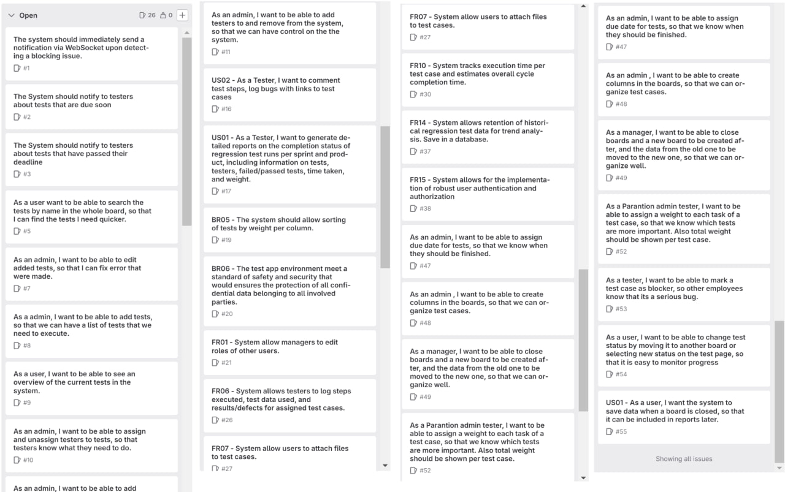

Every issue has user story related to it in the description

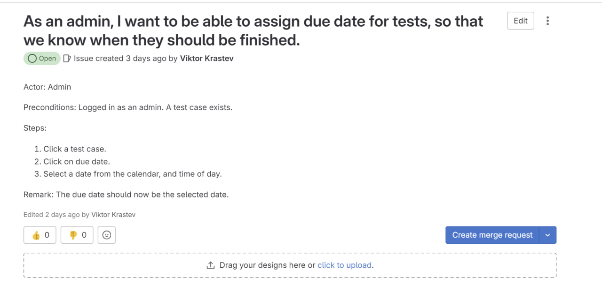

## Sprint 0
*Start up*

### Meeting 1 - 21.11.2023 9:30
Scrum Master - Jafar

In this meeting the assignment description was analyzed.

Present:
Jafar,
Viktor,
Justin,
Ruben,
Alex,
Yaroslav,
Ferhat

Absent:

### Meeting 2 - 23.11.2023 15:00
Scrum Master - Jafar

In this meeting, we discussed what should be included in the startup stage. A document structure was also created.
Each member wrote part of the PoA and requirements.

Present:
Jafar,
Viktor,
Justin,
Ruben,
Alex,
Ferhat

Absent:
Yaroslav - sick

### Meeting 3 - 24.11.2023 20:00
Scrum Master - Jafar

In this meeting, we discussed functional design and its items, as well as assigned tasks to team members.
This meeting was held via Discord on Friday.

Present:
Jafar,
Viktor,
Yaroslav,
Alex

Absent:
Justin,
Ruben,
Ferhat

### Meeting 4 - 28.11.2023 9:00
Scrum Master - Viktor

This was the meeting with the client, we went to Parantion and talked with the client. We asked some of our questions and got a clearer idea of what we have to deliver.

Present: 
Viktor,
Justin,
Ruben,
Yaroslav,
Alex,
Ferhat

Absent:
Jafar, sick

### Meeting 5 - 29.11.2023 14:10 
Scrum Master - Viktor

In this meeting, we looked over the issues after the meeting with the client and filtered the board, edited, removed and
added missing ones. We also talked about the tasks we will do after this meeting.

Present:
Jafar,
Viktor,
Justin,
Ruben,
Yaroslav,
Alex

Absent:
Ferhat, working

### Meeting 6 - 30.11.2023 9:45
Scrum Master - Viktor

In this meeting, discussed what we did on the tasks that we assigned to each other and what else needs to be done. We 
then worked on completing the business, user, functional and non-functional requirements.

Present:
Jafar,
Viktor - late 40 minutes,
Justin,
Alex,
Yaroslav,
Ferhat - late 1 hour 30 minutes

Absent:
Ruben - had other class at the same time

### Meeting 7 - 2.12.2023 15:00
Scrum Master - Viktor

In this meeting, we finalized the documentation that needs to be sent for the deliverables.

Present:
Jafar,
Viktor,
Alex,
Ruben,
Yaroslav

Absent:
Justin - at work, 
Ferhat

### End of sprint 0

### Retrospectives

#### Jafar

During the initial phase of our startup, I took on the role of the scrum master in the first week. This involved 
creating the initial project structure, setting up requirement issues, and initiating key Scrum documentation such as
parts of the team plan, PoA, and DoD. As the organizer and facilitator of team meetings, I ensured that our discussions
were focused on meeting project requirements and maintaining project timelines.
In addition to my managerial responsibilities, I actively contributed to the project's technical aspects. This included 
working on the functional design and playing a pivotal role in the creation of the PoA and requirements. Throughout the
sprint, I gained insights into the documentation and the necessity
for clear and concise requirements from the project's inception. Moving forward, I recognize the importance of fostering
early and continuous communication among team members to enhance collaboration and overall efficiency. 
The positive outcomes achieved during this sprint, notably the completion of documentation and the establishment of a
template code structure, stand as motivating milestones for our team as we transition into the next phase of our project.

#### Viktor

During start up stage, Sprint 0, the group started doing the documentation required to lay 
the foundations for the project. I personally made about 10-15 requirements, which I 
added to gitlab. Worked on the PoA file. In the second week I read through all 
requirements that the group had made and noted which ones are bad, good, 
duplicates and any other note I had about them. On the second meeting I talked 
with the group about the notes I made and we cleaned the requirements. In our 
meeting on saturday where we finalized the documentation, I made the technical 
design and added more information about the meetings.

#### Alex

I concentrated on creating a stoner-friendly interface that aligns with the design conditions. 
The runner displays test way with applicable details similar as ID, name, weight, 
and completion state. I enforced interactive features, allowing druggies to click on a test 
to punctuate it and change its completion state. 
To enhance collaboration, I integrated the frontal end with the aft end, enabling flawless 
communication between the two. This involved running asynchronous requests for costing and streamlining test way. also, 
I worked on a point that allows druggies to add new test way, contributing to the overall functionality of the operation.

#### Yaroslav

At the start of this project, I was working on our project documentation. I build several diagrams
for our frontend pages, also added functional and non-functional requirements. I was not present on our first class, as
I got a flu, but still I worked actively during this sprint. During our meetings I explained that we had a
misunderstanding in our requirements and functional design, which lead whole team to study materials about requirements
and then we built them correctly.

#### Justin

At the project's start, I worked on documents, like the code of conduct, and tweaked some requirements. In this sprint, I took on designing the database, which you can find in the functional design. It was tricky because everyone had different ideas.

A challenge we faced was communication issues due to different schedules. Personally, I prefer not to work evenings to spend time with family and friends. Unfortunately, this meant missing some Saturday meetings, as I'm committed to work that day.

To improve, I'll be more flexible and plan sessions proactively to ensure I can participate.
#### Rubén

This first Sprint has been good, we began to develop the documentation and begin the first steps of the project.
For my part, I have collaborated on some parts of the documentation, for example adding roles and team targets.
On the other hand, I also collaborated in the creation of requirements, and later in the selection of the final requirements.
At the beginning of Sprint, the idea was to use Type Script, so I started reading documentation and watching tutorials to learn before starting to program.


#### Ferhat
I've been a bit busy with my work and other meetings that in the first two weeks. I tried my best to attend all
the classes and meetings. So far, our focus has been on the documentation and designs. I've created wireframes and
added them to Technical Document, explaining the functionality they provide to the user. Additionally, I've included business
requirements in the functional design documentation. We've also discussed the project's boundaries and risks, and I've
documented those in the Plan of Approach. Moving forward, I plan to maintain a balance between work and meetings to enhance
my productivity for the team, ensuring active participation in our upcoming meetings.

## Sprint 1
*First coding*

### Meeting 8 - 5.12.2023
Scrum Master - Justin

During this meeting we discussed our progress and problems that each member encountered during the work.
Main problem was that we all focused on creating basic frontend for all the pages we have planned. As a result, big
components were created that were only suitable for one specific page and could not be used for other pages, which
lead to lots of code duplications. For backend, we kept working on the database and built some starting routers for
the server. We were only about to switch to basic js instead of typescript, so some system files and js files
which had typescript code should be changed in the backend.

Present:
Jafar,
Justin,
Ferhat,
Viktor,
Alex,
Ruben,
Yaroslav

Absent:
Justin

### Meeting 9 - 7.12.2023
Scrum Master - Justin

At this meeting some of our members shared that they have problems using bootstrap library for frontend styling. So
we grouped up and helped each other to understand some basic principles of bootstrap. It made code with bootstrap
readable for everyone and we moved on splitting our tasks. About three main pages were ready, and we had to finalize
database design to know if we were missing something.

Present:
Jafar,
Justin,
Ferhat,
Viktor,
Alex,
Ruben,
Yaroslav

### Meeting 10 - 12.12.2023 9:30
Scrum Master - Ruben

In this meeting, discussed what we did on the tasks that we assigned to each other and what else needs to be done. We
then worked on the main page and also with database.

We will use status to change issues from one column to another one.
We decided to split our work in each page. I mean that 2 of us will 
work in the same page(one doing frontend, another one doing backend).

Present:
Ruben,
Jafar,
Viktor,
Justin,
Alex,
Yaroslav,
Ferhat

### Meeting 11 - 14.12.2023 10:00
Scrum Master - Ruben

In this meeting, discussed what we did on the tasks that we assigned to each other and what else needs to be done. 
We then worked on the main page.
The database has been created, and from here we can work with the backend and see results.
Each member of the group has an assigned task, so we have to keep working

Present:
Ruben,
Jafar,
Viktor,
Justin,
Alex,
Yaroslav,
Ferhat

### End of sprint 1
Board at the End Of Sprint
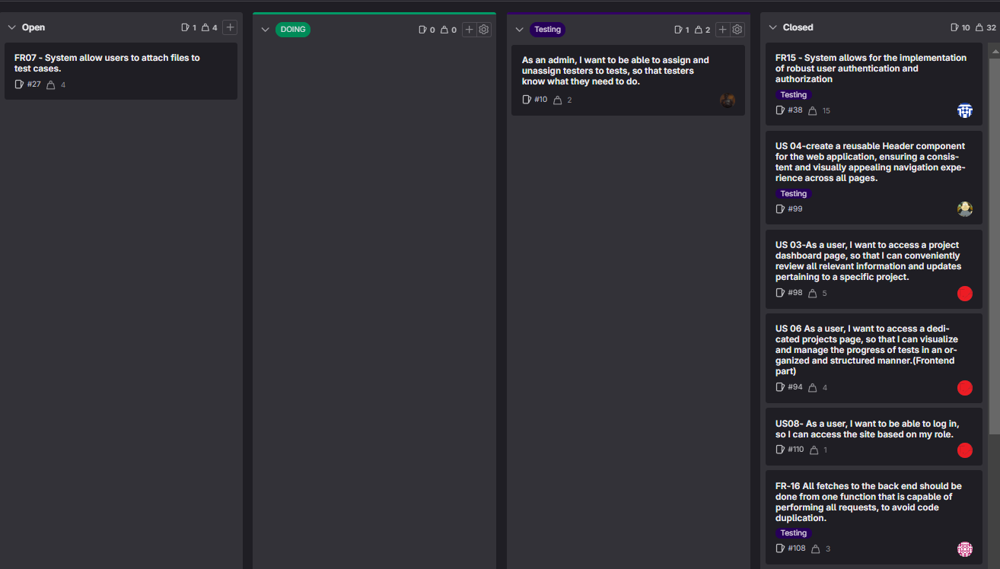
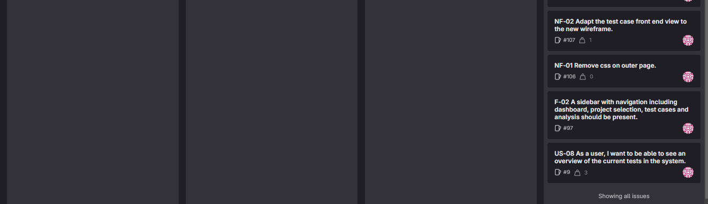

One issue that was planned to be done remained, and that was the possibility to attach files. The assigned person was unable to finish it. So it will be moved to the next sprint.

### Burn down chart
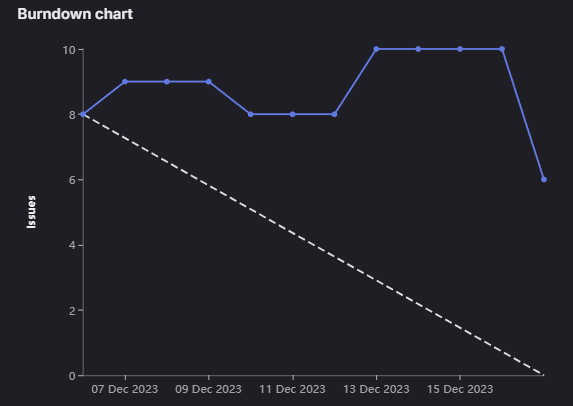

The burn down chart started out low, as we had not yet had the starting meeting. The first increase is that first meeting, where we created a backlog for it. The reason it does not go down after, is that the choice of issues was not good enough, and we had to continuously add new issue throughout the sprint.

### Retrospectives

#### Jafar

In Sprint 1, there were some things that went well. I was responsible for create a dashboard page  and also a side bar
component which we change it later and the login page and connected front end to the token in backend and Additionally,
I took the initiative to learn more about GitLab and understand the structure of our codebase. This helped me contribute
to the project and collaborate with the team. However, there were some challenges that arose during Sprint 1. One area
where things didn't go well was with the typescript, and we decided to use JavaScript. This is something I acknowledge
as an area for improvement, and I will strive to make team goals more important than anything. Additionally, on the
backend front, we encountered challenges with the database, prompting us to initiate a fix and focus on refining our
database controllers for smoother operation moving forward. We encountered difficulties in properly utilizing GitLab 
for code management and struggled with leaving meaningful comments in our commits. This led to some confusion and 
inefficiencies. It's important for us to address these challenges and find way to improve our GitLab workflow and 
communication around code commits in the upcoming sprint. 


#### Viktor

During the sprint, I attempted to create code that can be used by all people, to help he team progress faster. During this sprint I made the Request.js which's idea was to help with the requests, to reduce duplicate code, to not have to call the token store. I also attempted to do some front end, but my skills are very lacking there. Overall I don't think I did enough during this sprint, so I will push myself harder the following 2 sprints to make up for it.
#### Alex

During this sprint I have started working on test case details page and succeed with it. The hard part about this sprint was email notifications, 
I put a lot of effort into it while researching and failed to finish task. 
Then I decided to abandon this task and get to work with front-end again. 
#### Yaroslav

During sprint 1, I figured out that our team did not have enough wireframes and it was not clear which pages should
be created and how should they look. So I worked on these models and wireframes for our web application which made it
clearer what should we include in the project. During the sprint I shared the idea that we all should work on both
frontend and backend, but we should not be too focused on styling the frontend, as later on we have to make similar
style for all the pages, which could also optimize user interface and the frontend code.
At the start of this sprint I also found that we have different ideas on the database structure, so I asked my team to
work together on the database design and we came up with solution that looked closer to be final version of the
database. From our sprint 1 meetings I understood that it is not needed to hurry in database design as it is easy
to miss important relations and entities. Also, I worked on the database queries for the backend and dummy data to fill
the database with.

#### Justin
This sprint involved a continuous cycle of identifying missing elements in the database and subsequently updating it to accommodate changes required by the team. In the latter half of the week, I focused on developing a header component. This task was particularly challenging and time-consuming for me, as webpage design and JavaScript are not my areas of expertise, unlike some of my project members.

#### Rubén

This second Sprint has been quite a challenge for me. I got lost very quickly and I didn't really know what to do,
the project moved very quickly in a short time and I didn't know how it worked. For a few days I didn't know how to make it work until I asked,
and they explained everything that had to be installed and what files had to be executed.
Even so, I had to do my tasks, one of them was to make the dashboard; However, when I did it it didn't help much as it was later assigned to another member.
I spent many hours, since I didn't know what to do and my experience in JavaScript was very low.

#### Ferhat

This sprint, me and my friend have done the database together. But we had to change it twice. Now it's much better than previous one.
Probably we will change small things on database but, it shouldn't be a problem.
We had to change the database because of the leek of communication with our teacher and client. We thought we can use
a database management system that we are not allow to use, that's why we had to change the database.
For next time I will make sure that we are allow to use what we want to use before implementing it.

## Sprint 2
*Slight downfall*

### Meeting 12 - 19.12.2023 10:00
Scrum Master - Yaroslav

During meeting 12 we discussed front and back end implementations that we have achieved. Viktor generified work
for requests for backend and frontend. We still saw that this generic solution has to be improved to be used with ease.
We progressed with test overview, sprint overview, and test edit pages on frontend. For backend we had some issues
with the database, so we decided to fix it and keep working on database controllers.

Present:
Ruben,
Jafar,
Viktor,
Justin,
Alex,
Yaroslav,
Ferhat

### Meeting 13 - 21.12.2023 16:00
Scrum Master - Yaroslav

Generic functions were improved, so it was possible to use them for controllers in the backend. Our team had troubles
with frontend pages design, as each page had its own style. We had to work on creating similar design for all pages, 
so that style would not be that different. We started building nice controllers/routers for backend and
frontend, using generic functionality for fetch requests. We split tasks to be done for holidays.

Present:
Ruben,
Jafar,
Viktor,
Justin,
Alex,
Yaroslav,
Ferhat

### Meeting 14 - 09.01.2024 16:00
Scrum Master - Alex

This was our first meeting after holidays. We analysed what has been done. Frontend design was more shared between the
pages, there were still a lot of work to do to make it look better and make it more user-friendly. For backend, most
parts were done, some members had issues with the database queries, so we fixed them together. We decided to focus
on optimizing our code further.

Present:
Ruben,
Jafar,
Viktor,
Justin,
Alex,
Yaroslav,
Ferhat

### Meeting 15 - 11.01.2024 16:00
Scrum Master - Alex

In our 15th meeting, we continued making significant progress on both the front-end and the remaining backend tasks. 
The changes made during the holiday period were reviewed, and the team acknowledged the improvements in frontend design with a more cohesive and shared style across pages.
However, it was noted that there was still work to be done to enhance the overall user-friendliness and appearance.

Present:
Ruben,
Jafar,
Viktor,
Justin,
Alex,
Yaroslav,
Ferhat

## End of sprint 2
Board at the End Of Sprint

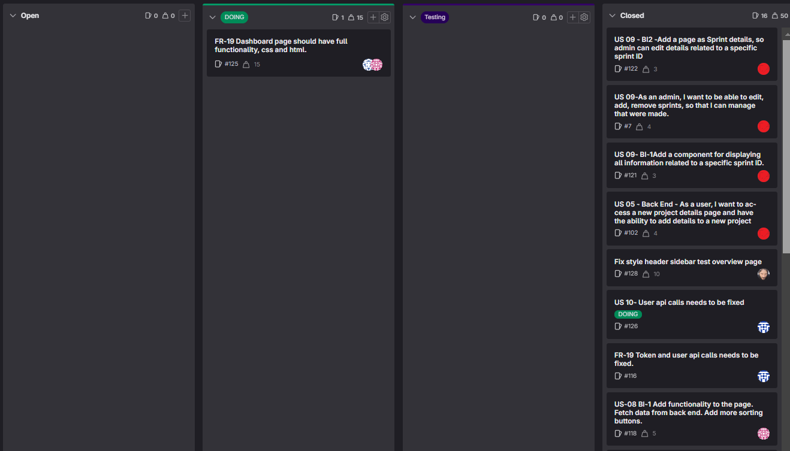
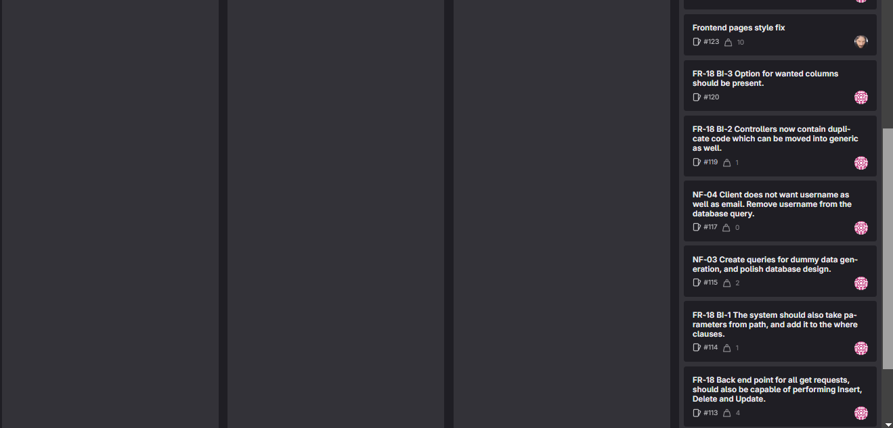
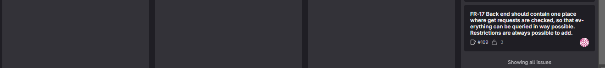

One issue remained. Due to also doing other tasks, this one remained unfinished. It will be moved to the next sprint.

### Burn down chart
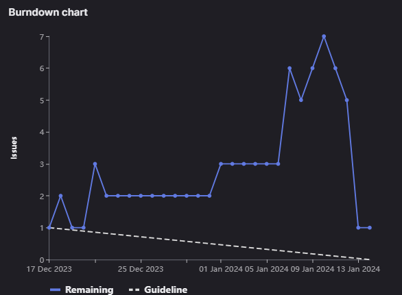

Due to miscommunication in our team, the git board was not handled 
properly, and issue were not added in the start, but gradually being 
completed and new ones being added. 

### Retrospectives

#### Jafar
this sprint showcased a commendable level of collaboration and effort from the team. While each member faced their own 
set of challenges, their collective contributions propelled the project forward. It's evident that effective
communication and clear alignment on tasks could further streamline our workflow. I made  both the backend
and frontend aspects of the project during this sprint. 
I developed of the sprint page and sprint detail page, along with several related components crucial to their 
functionality. Additionally, successfully addressed issues with the token system for , ensuring the proper handling of
user information in the payload and enhancing security measures. 

#### Viktor
My will to improve team productivity much higher since last sprint I don't think I did enough. So,
I attempted to create a system which will allow us to increase our back end work, I think I succeeded.
While it had many flaws, I think it was a good attempt, and some of the team liked it,
some of the team was sceptical or did not care, but I am sure it was good. 
I did a bunch of edits to the database to account for bad designs or new ideas.
I also tried creating a front end page for the test cases, which's js was good, but then later changed by yaroslav to be made better. Overall I think I did better than first sprint.

#### Alex

During the alternate sprint, my focus was on expanding the functionality of the test step runner 
by enforcing the capability to add new test way. I successfully integrated the frontal page of test steps
This involved running asynchronous requests backend, allowing for the creation of new test way.
In addition to the front-end work, I took on the responsibility of developing the entire backend sense for managing test steps.
This included handling requests to produce, update, and recoup test way, facing a smooth inflow of data between the customer and the website.
I laboriously banded with platoon members to align the functionality with design conditions,
making necessary adaptations grounded on feedback. The integration of the new test step functionality enhances the overall stoner experience and contributes to the design's pretensions.

#### Yaroslav

During sprint 2, I was convincing the group that we should start restyling the pages as soon as possible, as it would
take lots of time to make sure that our design and page styling is similar for every page. We decided that I will
be responsible for restyling the pages, team expected this to be simple changes in CSS files, and we also assumed that
some HTML may change. I started with changing the header and sidebar, because there were bugs with visual positioning
of the page itself. It took more time than we expected, and also I saw the opportunity to optimize our frontend script.
Some team members did not like the fact that I was going to change their styling as it would make some components extra.
I restyled test overview page, which took me a lot of effort and time, but I understood that it would be easier for
other pages as they would look like this one. All team was very happy with the new design, so we decided that I would
keep restyling the pages.

#### Justin
During this sprint, my primary task was to develop a WebSocket for dispatching push notifications to connected clients. The most challenging aspect of this project was integrating the WebSocket with the frontend. I encountered recurring issues with the WebSocket's stability, which persisted throughout the sprint.

#### Rubén

At the beginning of this Sprint I had a bit of a hard time because I couldn't connect the database to my project, which frustrated me. However, by asking I was able to download everything I needed to link the database to the project. It's my first time doing this, so thanks to my colleagues I was able to get it and have the project operational. Some variables in the database also had to be changed to be able to add the data for the graphs.
In the second Sprint I have focused on making the Sprint Details page. This page was still half empty and I had to make it more beautiful and add some graphics to control the data of that
sprint specifically.

#### Ferhat
During this sprint, my focus was changing API calls for users, middlewares, and creating token. I was done with these last sprint but
we have changed the database for users and I had to change it from the backend. Then my friend Viktor created a generic class
for queries and I had to change again. At the end we were done with the whole backend, with using generic class.
Communication could've been much better, but it wasn't the worst. If my team-mate told me that he was working on generic 
class for backend, I wouldn't work on API calls for users and would have work on something else for the project.
For next time, I would say everyone should be more clear what they are working on.

## Sprint 3
*The redemption*

### Meeting 16 - 16.01.2024 9:00
Scrum Master - Viktor

Right after this meeting, we had scheduled an on place meeting with the client, so we set up this meeting, so we can talk about what we are going to show. As well as clear up the gitlab board, ideas for next sprint will be set up during/after client meeting.

Present:
Jafar,
Viktor,
Justin,
Ruben,
Aleks

Absent:
Ferhat - sick,
Yaroslav - sick

### Meeting 17 - 16.01.2024 11:15
Scrum Master - Viktor

This was the client meeting, we should Nick what we have so far, and what we got to finish. He gave us a lot of feedback on what we have to do, improvements and gaps in our logic. He was sceptical that we can finish everything in just 9 days, and so were we. After the end of the client meeting, with the knowledge of how much there is to do, we agreed to do a daily meeting for this and next week, so we can finish the project. We also set up a meeting for later that day, so we can distribute tasks, so we can start from today.

Present:
Jafar,
Viktor,
Justin,
Ruben,
Aleks,

Absent:
Ferhat - sick,
Yaroslav - sick

### Meeting 18 - 16.01.2024 17:00
Scrum Master - Viktor

This meeting was later the same day as the client meeting, as we found out that we have more work ahead of us that behind us, we distributed tasks to be started, and finished as soon as possible, possibly by next day.

These were the tasks that we assigned to each other.

```
Yaroslav -> move test table to dashbaord, add add test case button to testoveview, remove checkbox and status in testcaseoverview only. Dashboard test case status from dropdown. Style of sprint page. Click on entire test case.
Viktor -> sort by wiehgt, remove differnet role from databse, add statusid to jucntion table. Redirect to log in if not logged in. Fix id in test case overvierw page. ???
Ruben -> burndown
Ferhat -> User page -> create user, change passowrd/email, and role
Jafar -> sprintdetails page, delete confirmation for sprint, role dependant front end. kinda only for sprints
Alex -> test step page
Justin -> finish notification, eimail notifications, remove profile and setting from header dro pdown.
```

Present:
Jafar,
Viktor,
Justin,
Ruben,
Aleks,
Yaroslav

Absent:
Ferhat - sick,

### Meeting 19 - 17.01.2024 22:40
Scrum Master - Viktor

This meeting was the day after we decided to do daily meetings. We first looked at what tasks were finished. 

Done:
```
Yaroslav -> move test table to dashbaord, add add test case button to testoveview, remove checkbox and status in testcaseoverview only. 
Viktor -> sort by wiehgt, remove differnet role from databse, add statusid to jucntion table. Redirect to log in if not logged in. Fix id in test case overvierw page. ???
Ruben -> burndown
Ferhat -> 
Jafar -> delete confirmation for sprint, role dependant front end. kinda only for sprints
Alex -> 
Justin -> finish notification, eimail notifications, remove profile and setting from header dro pdown. maybe
```

Remaining:

```
Yaroslav -> Dashboard test case status from dropdown. Style of sprint page. Click on entire test case.
Viktor -> Fix id in test case overvierw page. ???
Ruben -> Css of Charts
Ferhat -> User page -> create user, change passowrd/email, and role
Jafar -> sprintdetails page
Alex -> test step page
Justin -> 
```

Good start, some of the tasks that were given were too big for one day to finish, or a lot of small tasks, so that is the reason some people do not have finished tasks.

We then gave new tasks to everyone, or just reassigned old ones, that need to be finished.

```
Ruben- sprint detail
Viktor - attahcment table, files, dashboard, testcase ovewrview fix, back end for attachments, ?and comments?,  put test by id? all usernames returns id too, fix test status stuff, fix put request error
Alex - test step page
Yaroslav - All sprints page, rmeove chekcbox from table
Justin - Nofirtaion/email? + dev ops?/Jafar
Jafar + ferhat + Vikotr - users page
```

We set up time for the next meeting, and with that we ended our meeting.


Present:
Jafar,
Viktor,
Ferhat,
Ruben,
Aleks,
Yaroslav

Absent:
Justin

### Meeting 20 - 18.01.2024 15:00
Scrum Master - Viktor

As previous meetings, we looked what we have finshed, and what we still had to do. Some people had questions about their tasks, and we discussed them. 

Done:
```
Ruben - Charts, burndown and Donut
Viktor - attahcment table, files back end for attachments, and comments,  put test by id all usernames returns id too, fix put request error
Alex - 
Yaroslav - 
Justin -  Nofirtaion
Jafar + ferhat 
```

Remaining:

```
Ruben- sprint detail
Viktor - dashboard, testcase ovewrview fix, fix test status stuff
Alex - test step page
Yaroslav - All sprints page, rmeove chekcbox from table
Justin - dev ops?/Jafar
Jafar + ferhat - users page
```

A bit less progress done this time,but that is understandable, the meetings where only about 4 working hours apart. Due to this meeting being in class, we only verbally gave each other tasks, not the best idea, but mistakes happen. We set up time for the next meeting.

Present:
Jafar,
Viktor,
Ruben,
Aleks,
Justin

Absent:
Yaroslav - sick, Ferhat - sick

### Meeting 21 - 19.01.2024 20:20
Scrum Master - Viktor

In this meeting, we talked about our progress, what remained to be done. Progress had been done. Users page was present as well as more front end improvements.

Present:
Yaroslav,
Viktor,
Ruben,
Aleks,
Jafar

Absent:
Ferhat, Justin

### Meeting 22 - 20.01.2024 17:00
Scrum Master - Viktor

Same as previous meetings, we looked at what had been done, and what remained to be done.

```
justin -> add test
yaroslav -> account management page
viktor -> fix search bar, attachments in test step, asignee, total weight, users page js
ferhat -> add name to dashboard + burndown, add teststep page
ruben -> sprintdetials -> move add to middle, differnt date picker style , both sides equal size, more ?
alex -> edit teststep page, complete status selection 
```

Present:
Yaroslav,
Viktor,
Ruben,
Aleks,
Ferhat

Absent:
Jafar - work, Justin - work

### Meeting 23 - 21.01.2024 19:00
Scrum Master - Viktor

Same as previous meetings:

Tasks done:
```
justin -> add test
yaroslav -> account management page
viktor -> fix search bar, attachments in test step, asignee, total weight, users page js
ferhat -> add name to dashboard + burndown, add teststep page
ruben -> sprintdetials -> move add to middle, differnt date picker style , both sides equal size, more ?
alex -> edit teststep page, complete status selection 
```

To do:
```
justin -> null option for sprint/ assignee, add modules, css
ferhat -> edit test case page which contaisn -> edit name, add test step to it, edit weight, edit test log, edit test step number (change order) 
aleks -> add test step -> assign to test ,title, testlog, weight
jafar -> search sprint fix, fix report
yaroslav -> module page
ruben -> presentation
viktor -> make assignee sprint dependant
```


Present:
Yaroslav,
Viktor,
Ruben,
Aleks,
Ferhat,
Jafar,
Justin

Absent:

### Meeting 24 - 22.01.2024 22:00
Scrum Master - Viktor

Same as last meeting:

Done:
```
justin -> null option for sprint/ assignee, add modules, css
ferhat -> Uknown, not present
aleks -> add test step -> assign to test ,title, testlog, weight
jafar -> fix report
yaroslav -> module page
ruben -> presentation
viktor -> make assignee sprint dependant
```

Next meeting is right in the morning, so not many tasks were given out.

To do:
```
justni -> remove user id from test creation, make sprint drop down allow multiple sprints to be selected, module part css
yaroslav -> test case page
viktor -> fix burndown add reset button
```

Present:
Yaroslav,
Viktor,
Ruben,
Aleks,
Jafar,
Justin

Absent:
Ferhat

### Meeting 25 - 23.01.2024 08:30
Scrum Master - Viktor + Jafar for documentation

This was the last meeting in class, we once again looked at what we
had remaining to do, and what was done. Progress was looking extremely promising, so we started distributing documentation tasks, which Jafar took care of. 

To do:
```
Alex -> attachments, remove due date, exception handling
Ferhat -> finish edit page
Justin -> website deploayment, notification bugged again?
Viktor ->burn downt with dates, reset board, null user bug
Yaroslav ->
add test css
edit test css
add sprint css
Ruben - Wireframes
```

Documentation to do:
```
Scrum Documentation > Viktor
Functional Design:
Introduction > Jafar
Problem > Jafar
Solution overview > Jafar
Uses cases / User stories > Jafar 
Mockup / Wireframes > Ruben
Functional Requirements > done need to edit Jafar
Non-Functional requirements > done need to edit Jafar
Exception handling > Alex
Change Log
-------------------------------
system design:
Introduction > Ferhat
General overview and approach  > Ferhat
System Architecture > ? a diagram of system
Software architecture (overview, libs, protocols, frameworks, components, api’s, etc) > Justin 
Database design > Justin 
Test > Alex
Changelog 
```

Present:
Ferhat,
Viktor,
Ruben,
Aleks,
Jafar,
Justin

Absent:
Yaroslav

### Meeting 26 - 24.01.2024 14:0
Scrum Master - Viktor

Done:
```
Alex -> attachments, remove due date
Ferhat -> finish edit page
Justin -> website deploayment, notification bugged again
Viktor ->  null user bug + other bugs
Yaroslav ->
add test css
add sprint css
Ruben - Wireframes
```

There were a few tasks left to do, but we gave them to each other verbally so there is no record of them.


Present:
Ferhat,
Viktor,
Ruben,
Aleks,
Jafar,
Justin

Absent:
Yaroslav

### Meeting 27 - 25.01.2024 13:30
Scrum Master - Viktor

This was the last meeting before the final client meeting where we had to present the product. Everyone was hard at work to finish up any remaining tasks. Justin managed to get the docker images for the website. Viktor managed to get in the restart sprint. Ferhat, Ruben and Alex and Yaroslav implemented the middlewares for the different user roles and fixed some bugs. Jafar finished up the readme file. 

With all of this, we had pretty much done everything we wanted to do with the website. While it has many flaws, we were happy with it.

Present:
Ferhat,
Viktor,
Ruben,
Aleks,
Jafar,
Justin,
Yaroslav

Absent:

### Meeting 28 - 26.01.2024 17:00
Scrum Master - Jafar

After all the product was shown to the client, we shifted our focus to the documentation, and we switched scrum masters.

Done: 
```
Scrum Documentation > Viktor
Functional Design:
Introduction > Jafar
Problem > Jafar
Solution overview > Jafar
Uses cases / User stories > Jafar 
Mockup / Wireframes > Ruben
Functional Requirements > done need to edit Jafar
Non-Functional requirements > done need to edit Jafar
-------------------------------
system design:
Introduction > Ferhat
General overview and approach  > Ferhat
System Architecture > ? a diagram of system
Software architecture (overview, libs, protocols, frameworks, components, api’s, etc) > Justin 
Database design > Justin 
Changelog~~
```

There were some additional things done such as RESP API documentation.

Present:
Ferhat,
Viktor,
Ruben,
Aleks,
Jafar,
Justin,
Yaroslav

Absent:

### Meeting 29 - 27.01.2024 17:00
Scrum Master - Jafar

In this meeting we discussed the progress on the documentation.
Where pretty much everything was done except testing and scrum documentation.

Present:
Ferhat,
Viktor,
Ruben,
Aleks,
Jafar

Absent:
Justin,
Yaroslav


### Meeting 30 - 28.01.2024 16:00
Scrum Master - Jafar

This is the last meeting. All of us gathered, so we can finish everything, and send the project.

Present:
Ferhat,
Viktor,
Ruben,
Aleks,
Jafar,
Justin,
Yaroslav

Absent:

### End of sprint 3
Board at the End Of Sprint

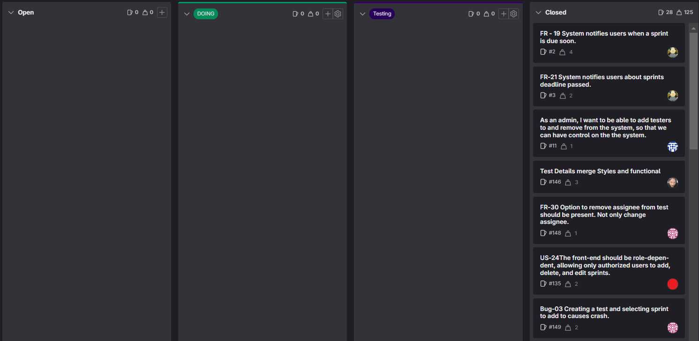
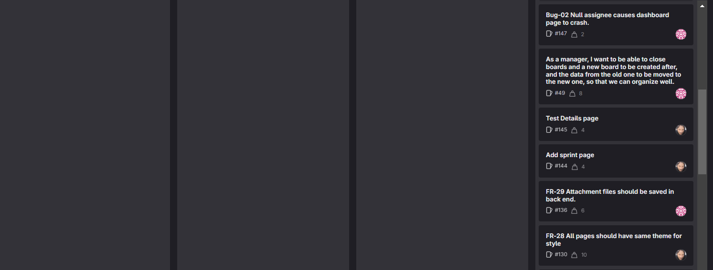
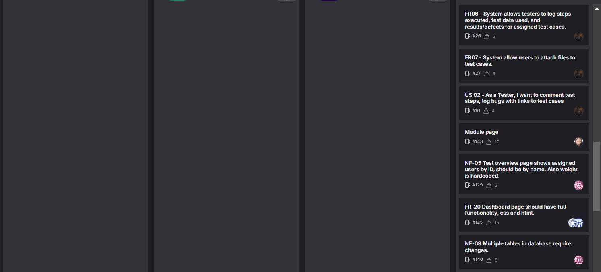
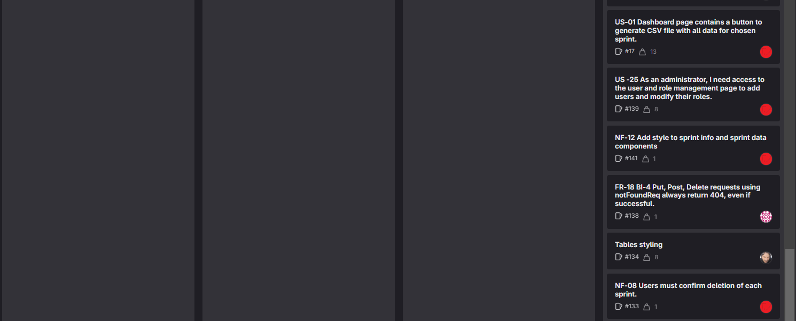
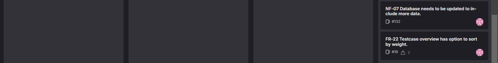

### Burn down chart
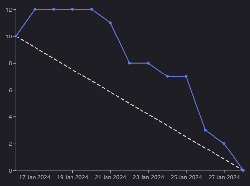

### Retrospectives

#### Jafar
In the previous sprint, we faced the realization that our workload exceeded our initial expectations, leaving us with
limited time to accomplish our tasks. In response, the team collectively decided to implement daily meetings to ensure 
consistent progress, a strategy that proved effective in moving us forward. Personally, I took on various 
responsibilities, including enhancing existing pages, introducing critical components such as user management and 
report generation, as well as developing a search feature. Additionally, I dedicated time to documenting our project's 
finalization process. Reflecting on Sprint 3, I am genuinely pleased with the substantial progress we made. However,
there's always room for improvement, and I acknowledge that.
#### Viktor

During the last sprint, we found out that we had a lot to do, even more than we have done so far, and with such little time. The whole team agreed to do daily meetings so we can make progress, and we did. I decided to take the spot of the scrum master, because I had lost my belief in my team, but they mostly redeemed themselves in my opinion. Any time I was not in class or eating or in the gym, I was working on the project, thus I managed to make a lot of progress. I improved the database design a lot. I helped to fix a lot of bugs or issues from other teammates, before they went to main, or after they were in main. I attempted to answer any question by any teammate as soon as possible, and I think I succeeded. In our group discord I have over 750 messages since the start of the push to finish the project. Not all are related to helping of course, but a lot are, and there are more that were sent privately to me. Overall I am very happy with how sprint 3 went, I  think I did incredible amount. I am very happy with how it went, it could have been better though, of course.


#### Alex

Final sprint I have been working on backend for comments and files. Hence I added attachments to be displayed for every teststep and made a selection procedure to upload comments or files ONLY to the selected teststep.
My final task was to add modules on test case details page and select or add them to a certain teststep.
Everything went well during this sprint, however I put the most effort during this sprint.
#### Yaroslav

During sprint 3, unfortunately, I missed some classes due to health problems, but I worked a lot on restyling and
optimizing frontend code. I created modules page and wrote some backend for it, I asked my teammates to check if I did
everything we needed for this page both on frontend and backend. Basically, I restyled every single page that we have
in the project, wrote some additional code to add functionality to our pages. While doing that I found different
problems in the code that led to errors and crashes, so I called my teammates, and we discussed and implemented
solutions for them. By the time we had to present our project to the client, we have finished the project and only had,
some documentation to finalize. It was a great experience to work in such well-organized, friendly and accountable team.

#### Justin
This sprint was exceptionally challenging. In the final week, our client expressed doubts about our ability to complete the project on time, which significantly heightened the pressure. However, we rallied together, addressing our communication issues and collaboratively pushing through the obstacles. Each of us dedicated more than a standard workweek's hours to ensure the project's success. My contribution included creating a page for adding tests and attempting to deploy the website. Despite my efforts, I only achieved partial success due to the constraints imposed by the Saxion network.

#### Rubén

This last Sprint I have integrated much more with the team and I have done everything they have asked of me. This time I had things clearer and I knew what I had to do.
My main objective was to create graphs, including the burndown chart and in addition to the donut chart, this was a challenge for me. I had never implemented something like this, but chart.js offers many possibilities, and after reading the documentation and watching tutorials I understood how to do them. Even so I had a problem with the library, it gave me quite a few errors until I was able to solve it.
I also had to manage the CSS of the Sprint Details page.
Finally, I collaborated with the Documentation, for example redoing all the Wire Frames, since the page had changed a lot.

#### Ferhat
Finally, we are done with the project. In this sprint we all worked on frontend. Unfortunately, I was sick on 7th week.
I have done line and donut chart for
sprint dashboard. It was hard coded before, now it's connected to backend and shows how many tests have passed and how many
tests needs to be done in that sprint.
Nothing went wrong, everything was good with my team-mates, and we have finished the project on time. We were much better
with communication part as well. At the end we are delivering a web application that has a role-based login system that you
can create sprints, tests and test steps. We are happy with our project now.
