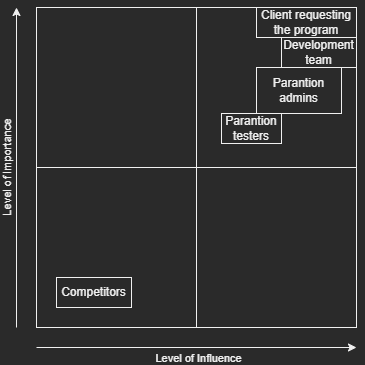

# System Design
`Revision: 1.2`

# Table of Contents
- [Introduction](#introduction)
- [General Overview and Approach](#general-overview-and-approach)
- [Design Considerations](#design-considerations)
- [System Architecture](#system-architecture)
  - [Logical View (Functional Components)](#logical-view-functional-components)
  - [Software Architecture](#software-architecture)
  - [Security Architecture](#security-architecture)
- [System Design](#system-design)
  - [Database Design](#database-design)
  - [Software Design](#software-design)
- [Change log](#change-log)

## Introduction

### Background
In the fast-paced world of web development and project management, having the right tools is crucial.
Our web application steps up to the plate, providing a user-friendly platform that simplifies project tasks and
ensures top-notch quality

### Purpose
The purpose of this system design document is to provide a detailed understanding of the architecture,
functionality, and design principles that govern our web application. It serves as a comprehensive guide for developers,
stakeholders, and anyone involved in the project, offering insights into the intricacies of the system's design and
functionality.

## General Overview and Approach

### Overview
Our web application is designed to streamline project management and quality assurance processes by providing
a user-friendly platform for managing sprints, test cases and test steps. The system incorporates a secure login system,
role-based access controls, and intuitive features to enhance collaboration within project teams.

### Approach

#### Project Management
The core functionality of our system revolves around project management. Users, based on their roles, can view 
project details, including overview of sprints and associated test cases. This provides a holistic view of the
project's progress and upcoming tasks.

#### Test Case Management
Within each sprint, our application allows users to interact with test cases. Users with appropriate permissions can
create new test cases, assign team members to specific cases, and manage the details of each test case, including its
test steps.

#### Test Steps and Assignments
Test cases consist of individual test steps, each having a weight, test log and step number. Our system empowers users
to edit, delete, or add test steps as needed. The flexibility of test step management ensures that the testing process
is well-documented and adaptable to changing project requirements.

#### Role-Specific Actions
To maintain a clear and secure workflow, actions such as editing, deleting, and adding are role dependent. This approach
ensures that users only have access to functionalities that align with their responsibilities, fostering collaboration
while safeguarding sensitive project information.

# System Architecture

## Framework Choices

We decided to use Svelte for front end, since we had a course last quartile and have some experience with it.
We also decided to use typescript for both front end and back end. We decided that it will be good for us, since its close to javascript, and we would like to learn it.
For database we decided to use posgressQL, no really concrete reasons why it over others.

## Logical View (Functional Components)

A diagram showing how each component is connected.

## Software Architecture
## Overview

Our system consists of three main parts:

1. **Frontend**: Developed with Svelte and Vite.
2. **Backend**: Uses Express.js and a PostgreSQL database.
3. **WebSocket**: For real-time push notifications.

### Libraries

#### Frontend

- Chart.js for data visualization.
- WebSocket.js for real-time communication.

#### Backend

- bcrypt for password hashing.
- postgress.js for database interaction.

### Frameworks

#### Frontend

- Svelte + Vite for the main app.
- Bootstrap for styling.

#### Backend

- Express.js for server-side logic.
- WebSocket.js for managing WebSocket connections.

### WebSocket Protocol

For more on our WebSocket setup, see the **[WebSocket Protocol Documentation](SocketInstructions.md)**.

### API Documentation

For details on our API, check out the __**[API Specification](APIdocumentation.md)**__.

## Security Architecture
Ensuring the safety of our user information is a top priority for the system. Here's how the platform maintains security:

### JWT Tokens
When a user logs in, they receive a special token, a sort of digital ID card. This token ensures the user's identity,
functioning like a secret handshake between the user and the system.

### Middlewares
The system employs three special guard, or middlewares, to watch over the platform:
* Is User Logged In:
  * *Job: Verifies if the user possesses the secret token.*
  * *Result: Grants access only to users with the valid token.*
* Is User Admin:
  * *Job: Checks if the user has admin privileges.*
  * *Result: Unlocks special admin powers for authorized users.*
* Us User Developer or Admin:
  * *Job: Determines if the user is an admin or a developer.*
  * *Result: Allows access to special admin and developer areas accordingly.*

### Role-Based Access Control
The system follows a role-based access control model. Depending on the user's role (Admin, Developer, or a Tester),
specific access rights are granted. This approach ensures that each user has access to the features they need
without unnecessary complications.

### Hashed Passwords
User passwords are treated like secret codes. Instead of storing them plainly, the system transforms them into a
special kind of code using a process called hashing. This extra layer of security protects user passwords.

# System Design
## Database Design

Details about the database structure and schema

# Change log

## Influence Matrix

The influence matrix takes the stakeholders and visualizes who we need to prioritize.

