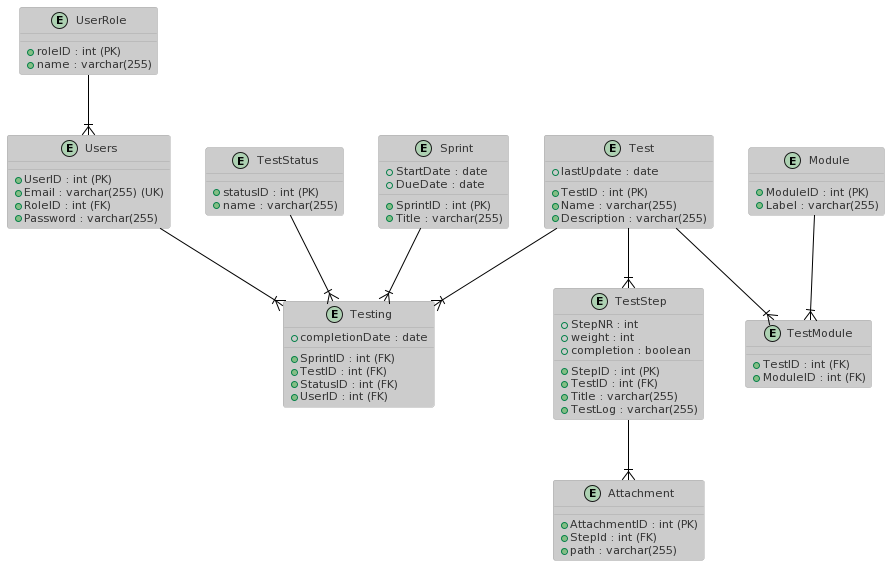
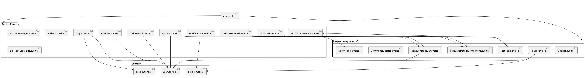

# Software Architecture

## Table of Contents

- [Overview](#overview)
- [Libraries](#libraries)
- [Frameworks](#frameworks)
- [Database](#database)
- [Component Diagram](#component-diagram)
- [WebSocket Protocol](#websocket-protocol)
- [API Documentation](#api-documentation)

## Overview

Our system consists of three main parts:

1. **Frontend**: Developed with Svelte and Vite.
2. **Backend**: Uses Express.js and a PostgreSQL database.
3. **WebSocket**: For real-time push notifications.

## Libraries

### Frontend

- Chart.js for data visualization.
- WebSocket.js for real-time communication.

### Backend

- bcrypt for password hashing.
- postgress.js for database interaction.

## Frameworks

### Frontend

- Svelte + Vite for the main app.
- Bootstrap for styling.

### Backend

- Express.js for server-side logic.
- WebSocket.js for managing WebSocket connections.

## Database

Details about the database structure and schema

## Component Diagram

A diagram showing how each component is connected.

## WebSocket Protocol

For more on our WebSocket setup, see the **[WebSocket Protocol Documentation](SocketInstructions.md)**.

## API Documentation

For details on our API, check out the __**[API Specification](APIdocumentation.md)**__.
